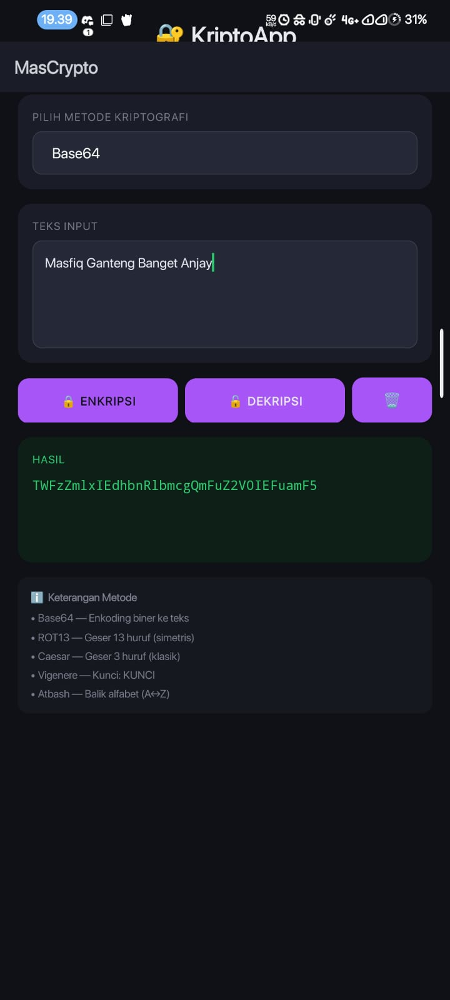

MasCrypto ini sebenarnya aplikasi Android sederhana yang saya kembangkan buat mempermudah proses enkripsi dan dekripsi teks , sekaligus untuk tugas ke 2 matkul pember. Alasan utama saya build dan pilih ide aplikasi ini karena saya punya ketertarikan khusus di bidang cybersecurity dan kebetulan semester ini saya juga sedang mengambil mata kuliah Kriptografi. Jadi, saya kepikiran buat sekalian mengimplementasikan beberapa metode populer kayak Base64, ROT13, Caesar Cipher, Vigenere Cipher, sampai Atbash ke dalam satu aplikasi. Pengguna cuma perlu input teks, pilih metodenya di dropdown, dan hasilnya langsung keluar.

### Screenshot Aplikasi

